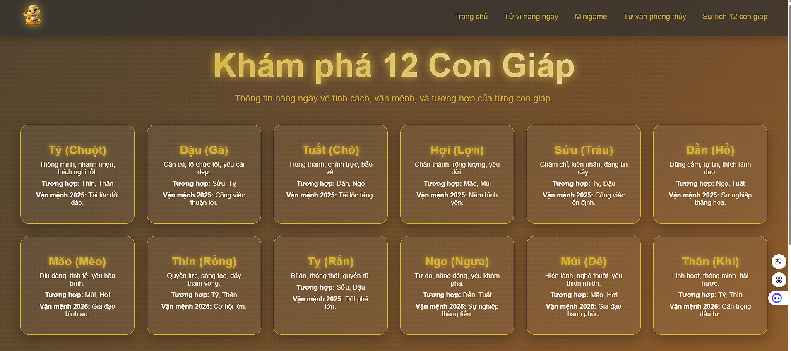
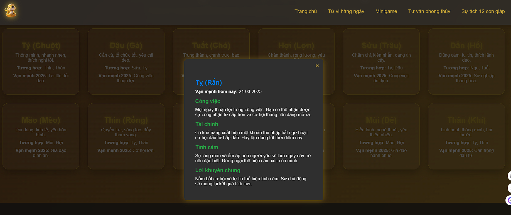
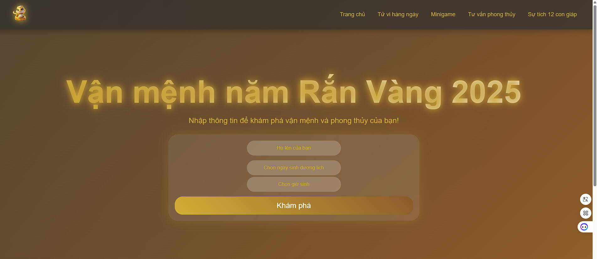

🏮 Dự Án 12 Con Giáp - Tử Vi Hàng Ngày
-

🌟 Giới Thiệu
-

Đây là một ứng dụng web được xây dựng bằng React + Vite, mang đến trải nghiệm xem tử vi hàng ngày dựa trên 12 con giáp. Người dùng chỉ cần nhập ngày sinh để nhận ngay dự đoán về vận mệnh, mức độ may mắn và những lời khuyên hữu ích cho cuộc sống mỗi ngày. Dữ liệu tử vi được tổng hợp từ các nguồn truyền thống kết hợp với thuật toán hiện đại, đảm bảo tính chính xác và thú vị.

- Site (MVP) : https://dungnt2508.github.io/zodiac_frontend

🚀 Công Nghệ Sử Dụng
-

Frontend: React + Vite

Backend: Django REST Framework + Dashboard AdminLTE

Database: MySQL

📌 Tính Năng Chính
-

- Xem tử vi hàng ngày dựa trên tuổi (12 con giáp).
- Dự đoán vận mệnh cá nhân hóa theo ngày sinh.
- Gửi dự đoán định kỳ qua:
    - Email
    - Telegram
    - SMS (số điện thoại)
- Tư vấn phong thủy cơ bản (vị trí nhà, màu sắc hợp mệnh, v.v.).
- Blog với các bài viết và câu chuyện độc đáo về 12 con giáp.
- Minigame hàng ngày.

📸 Hình Ảnh Minh Họa
-

📜 Lộ Trình Phát Triển
- 
- Giai đoạn 1: Xây dựng bản MVP và tích hợp API tử vi cơ bản. (14/3/25 - 28/3/25)
- Giai đoạn 2: Xây dựng hệ thống gửi thông báo qua email, Telegram và SMS.
- Giai đoạn 3: Phát triển tính năng tư vấn phong thủy chi tiết và cải thiện UX/UI.
- Giai đoạn 4: Ra mắt blog với nội dung phong phú về văn hóa 12 con giáp.
- Giai đoạn 5: Bảo trì, nâng cấp hệ thống và bổ sung tính năng theo phản hồi người dùng.

💡 Đóng Góp & Phát Triển
-  
- Chúng tôi hoan nghênh mọi đóng góp từ cộng đồng. Nếu bạn có ý tưởng mới hoặc phát hiện lỗi, hãy gửi email hoặc mở issue trên GitHub.

📬 Liên Hệ
-
- 📧 gsnake6789@gmail.com
- 📞 093.797.4444